# Detr Notes

## Setup
installed libraries
- accelerate
- albumentations
- evaluate
- transformers
- timm
- pycocotools
- tensorboard
- torchmetrics

[TensorBoard](http://127.0.0.1:6006/#timeseries)

## Training Diary
- version1
  - num_train_epochs=3, logging_steps=100,learning_rate=1e-5
  - eval/loss: smooth = 0.6022, value = 0.5858, step = 1600
  - train/loss: smooth = 0.645, value = 0.6097, step = 1600
- **version2**
  - num_train_epochs=5, logging_steps=100,learning_rate=2e-5
  - eval/loss: smooth = 0.4985, value = 0.4724, step = 2800
  - train/loss: smooth = 0.5098, value = 0.5315, step = 2800
- version3
  - num_train_epochs=5, logging_steps=100,learning_rate=5e-5
  - 3_1
    - eval/loss: smooth = 0.5062, value = 0.5048, step = 2800
    - train/loss: smooth = 0.5339, value = 0.5708, step = 2800
  - 3_2
    - eval/loss: smooth = 0.4802, value = 0.5093, step = 2800
    - train/loss: smooth = 0.4999, value = 0.5161, step = 2800
- version4
  - num_train_epochs=3, logging_steps=100,learning_rate=5e-5
  - eval/loss: smooth = 0.4713, value = 0.5143, step = 1600
  - train/loss: smooth = 0.5709, value = 0.5368, step = 1600
- **version5**
  - num_train_epochs=2, logging_steps=100,learning_rate=5e-5
  - eval/loss: smooth = 0.4018, value = 0.4107, step = 1100
  - train/loss: smooth = 0.4926, value = 0.5039, step = 1100
  - train/learning_rate maximum at step = 200
- version6
  - num_train_epochs=2, logging_steps=100,learning_rate=5e-5, warmup_steps=200
  - eval/loss: smooth = 0.4595, value = 0.4984, step = 1100
  - train/loss: smooth = 0.4574, value = 0.4727, step = 1100
- version7
  - num_train_epochs=2, logging_steps=100,learning_rate=5e-5, warmup_steps=300
  - eval/loss: smooth = 0.4595, value = 0.4984, step = 1100
  - train/loss: smooth = 0.4574, value = 0.4727, step = 1100
- version8
  - num_train_epochs=2, logging_steps=100,learning_rate=2e-5, warmup_steps=300
  - eval/loss: smooth = 0.5033, value = 0.5736, step = 1100
  - train/loss: smooth = 0.4262, value = 0.4534, step = 1100
- version9
  - num_train_epochs=2, logging_steps=100,learning_rate=5e-5, warmup_steps=100
  - eval/loss: smooth = 0.4335, value = 0.4744, step = 1100
  - train/loss: smooth = 0.4499, value = 0.4547, step = 1100
- version10
  - num_train_epochs=2, logging_steps=100,learning_rate=5e-5, warmup_steps=50
  - eval/loss: smooth = 0.4335, value = 0.4744, step = 1100
  - train/loss: smooth = 0.4499, value = 0.4547, step = 1100
- version11
  - num_train_epochs=2, logging_steps=100,learning_rate=5e-5, warmup_ratio=0.1, load_best_model_at_end=False
  - eval/loss: smooth = 0.3807, value = 0.3828, step = 1100
  - train/loss: smooth = 0.4427, value = 0.4754, step = 1100
- ***version12***
  - num_train_epochs=2, logging_steps=100,learning_rate=5e-5, warmup_ratio=0.1, load_best_model_at_end=True
  - 12_1
    - eval/loss: smooth = 0.4257, value = 0.4692, step = 1100
    - train/loss: smooth = 0.3787, value = 0.405, step = 1100
    - eval/loss: smooth = 0.3960, value = 0.2881, step = 700
    - train/loss: smooth = 0.3420, value = 0.3453, step = 700
    - best checkpoint = 700
  - 12_2
    - eval/loss: smooth = 0.4485, value = 0.4972, step = 1100
    - train/loss: smooth = 0.5848, value = 0.6179, step = 1100
    - eval/loss: smooth = 0.4008, value = 0.3367, step = 1000
    - train/loss: smooth = 0.5764, value = 0.5447, step = 1000
    - best checkpoint = 1000
  - 12_3
    - eval/loss: smooth = 0.4616, value = 0.4996, step = 1100
    - train/loss: smooth = 0.5266, value = 0.5368, step = 1100
    - eval/loss: smooth = 0.4213, value = 0.3782, step = 1000
    - train/loss: smooth = 0.5175, value = 0.4977, step = 1000
    - best checkpoint = 1000
  - 12_4
    - eval/loss: smooth = 0.5974, value = 0.6367, step = 1100
    - train/loss: smooth = 0.5018, value = 0.556, step = 1100
    - eval/loss: smooth = 0.5206, value = 0.4851, step = 500
    - train/loss: smooth = 0.4952, value = 0.4775, step = 500
    - best checkpoint = 500
  - 12_5 - !model.model.freeze_backbone()
    - eval/loss: value = 1.072, step = 1100
    - train/loss: value = 0.5569, step = 1100
    - eval/loss: value = 0.6862, step = 1000
    - train/loss: value = 0.6972, step = 1000
    - best checkpoint = 1000
  - 12_6 - !model.model.freeze_backbone()
    - eval/loss: value = 0.4344, step = 1100
    - train/loss: value = 0.5552, step = 1100
    - eval/loss: value = 0.4885, step = 1000
    - train/loss: value = 0.5725, step = 1000
    - best checkpoint = 1100
  - 12_7 - !model.model.freeze_backbone()
    - eval/loss: value = 0.5809, step = 1100
    - train/loss: value = 0.4826, step = 1100
    - eval/loss: value = 0.5163, step = 1000
    - train/loss: value = 0.4942, step = 1000
    - best checkpoint = 1000
  - 12_8 - metric_for_best_model='eval_loss_bbox', greater_is_better=False
    - eval/loss: value = 0.4472, step = 1100
    - train/loss: value = 0.7846, step = 1100
    - eval/loss: value = 0.4443, step = 700
    - train/loss: value = 0.7087, step = 700
    - best checkpoint = 700
  - 12_9 - metric_for_best_model='eval_loss_bbox', greater_is_better=False
    - eval/loss: value = 0.4621, step = 1100
    - train/loss: value = 0.6428, step = 1100
    - eval/loss: value = 0.3505, step = 1000
    - train/loss: value = 0.5031, step = 1000
    - best checkpoint = 1000
  - 12_10 - metric_for_best_model='eval_loss_bbox', greater_is_better=False
    - eval/loss: value = 0.4965, step = 1100
    - train/loss: value = 0.8388, step = 1100
    - eval/loss: value = 0.3477, step = 1000
    - train/loss: value = 0.5338, step = 1000
    - best checkpoint = 1000
- version13
  - num_train_epochs=2, logging_steps=50,learning_rate=5e-5, warmup_ratio=0.1, load_best_model_at_end=True
  - eval/loss: smooth = 0.4184, value = 0.4085, step = 1100
  - train/loss: smooth = 0.4789, value = 0.4329, step = 1100
  - eval/loss: smooth = 0.4208, value = 0.3691, step = 900
  - train/loss: smooth = 0.5554, value = 0.5380, step = 900
  - best checkpoint = 900
- version14
  - num_train_epochs=2, logging_steps=20,learning_rate=5e-5, warmup_ratio=0.1, load_best_model_at_end=True
  - eval/loss: smooth = 0.4267, value = 0.4574, step = 1120
  - train/loss: smooth = 0.4201, value = 0.3519, step = 1120
  - best checkpoint = 900
- version15
  - num_train_epochs=5, logging_steps=50,learning_rate=5e-5, warmup_ratio=0.1, load_best_model_at_end=True
  - eval/loss: smooth = 0.5143, value = 0.5024, step = 2800
  - train/loss: smooth = 0.4862, value = 0.4743, step = 2800
  - eval/loss: smooth = 0.4675, value = 0.4134, step = 2200
  - train/loss: smooth = 0.4922, value = 0.4778, step = 2200
  - best checkpoint = 2200
- version16
  - num_train_epochs=3, logging_steps=50,learning_rate=5e-5, warmup_ratio=0.1, load_best_model_at_end=True
  - eval/loss: smooth = 0.5575, value = 0.5521, step = 1650
  - train/loss: smooth = 0.5239, value = 0.4893, step = 16500
  - best checkpoint = 800
- version17
  - num_train_epochs=10, logging_steps=50,learning_rate=5e-5, warmup_ratio=0.1, load_best_model_at_end=True
  - eval/loss: smooth = 0.4342, value = 0.4905, step = 5600
  - train/loss: smooth = 0.4976, value = 0.4931, step = 5600
  - eval/loss: smooth = 0.4549, value = 0.3676, step = 4500
  - train/loss: smooth = 0.3836, value = 0.3283, step = 4500
  - best checkpoint = 4500
- version18
  - num_train_epochs=5, logging_steps=100,learning_rate=3e-5, warmup_ratio=0.1, load_best_model_at_end=True, loss_giou
  - eval/loss: value = 0.5109, step = 2800
  - train/loss: value = 0.5638, step = 2800
  - eval/loss: value = 0.3773, step = 2000
  - train/loss: value = 0.4638, step = 2000
  - best checkpoint = 2000
  - Detection Performance mu: 9.758, std: 20.776
  - IOU mu: 0.916, std: 0.133
- version19
  - num_train_epochs=5, logging_steps=100,learning_rate=3e-5, warmup_ratio=0.1, load_best_model_at_end=True, loss_diou
  - eval/loss: value = 0.4752, step = 2800
  - train/loss: value = 0.5532, step = 2800
  - eval/loss: value = 0.4343, step = 2700
  - train/loss: value = 0.48, step = 2700
  - best checkpoint = 2700
  - Detection Performance mu: 6.124, std: 12.614
  - IOU mu: 0.934, std: 0.098
- version20
  - num_train_epochs=5, logging_steps=100,learning_rate=3e-5, warmup_ratio=0.1, load_best_model_at_end=True, loss_ciou
  - 20_1
    - eval/loss: value = 0.4417, step = 2800
    - train/loss: value = 0.5298, step = 2800
    - eval/loss: value = 0.3148, step = 2200
    - train/loss: value = 0.4870, step = 2200
    - best checkpoint = 2200
    - Detection Performance mu: 5.379, std: 10.813
    - IOU mu: 0.940, std: 0.085
  - 20_2
    - eval/loss: value = 0.4417, step = 2800
    - train/loss: value = 0.5298, step = 2800
    - eval/loss: value = 0.3339, step = 1700
    - train/loss: value = 0.4870, step = 1700
    - best checkpoint = 1700
    - Detection Performance mu: 4.622, std: 6.769
    - IOU mu: 0.945, std: 0.075
  - ***20_3***
    - eval/loss: value = 0.3699, step = 2800
    - train/loss: value = 0.4787, step = 2800
    - eval/loss: value = 0.3022, step = 1300
    - train/loss: value = 0.4966, step = 1300
    - best checkpoint = 1300
    - Detection Performance mu: 4.711, std: 6.775
    - IOU mu: 0.948, std: 0.052

## Notes

### Freeze backbone is useful

|            | with freeze backbone | without freeze backbond| without freeze backbond|
|:---------: | :------------------: | :---------------------:| :---------------------:|
|            | Version 12_3         | Version 12_5           | Version 12_6           |
| eval_loss  | 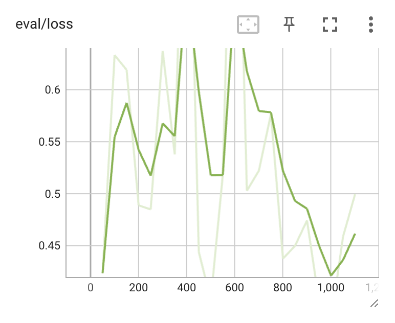 | 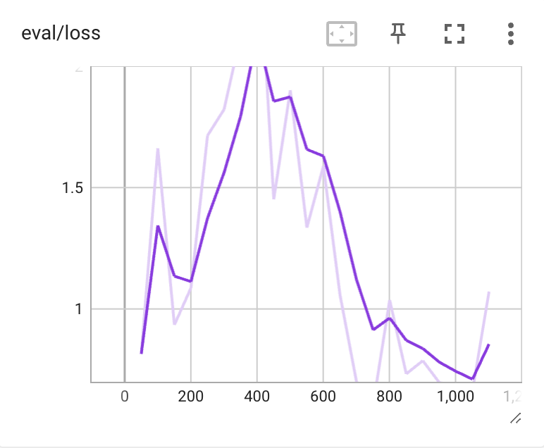 | 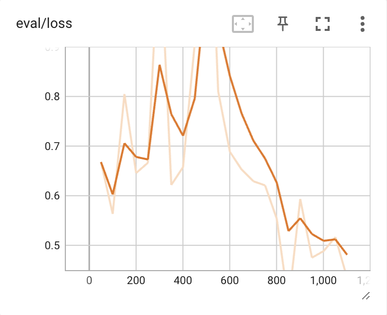 |
| train_loss | 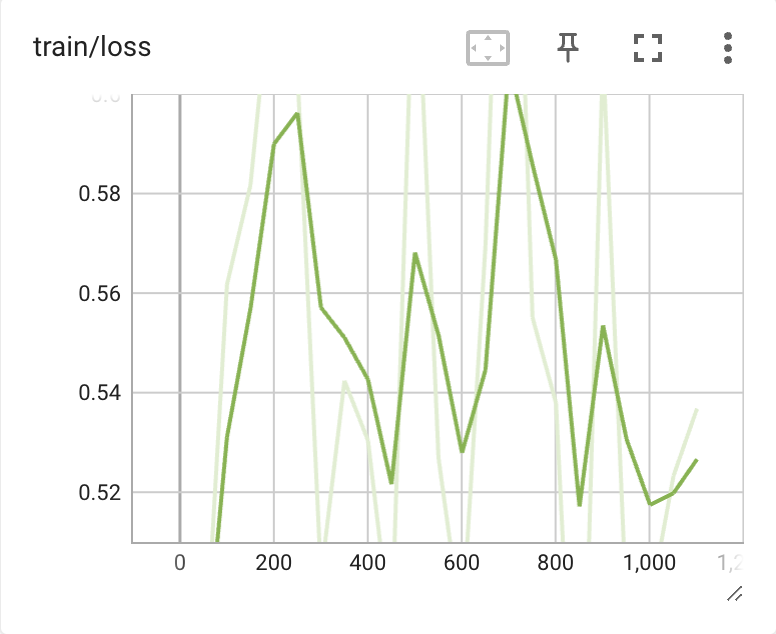 | 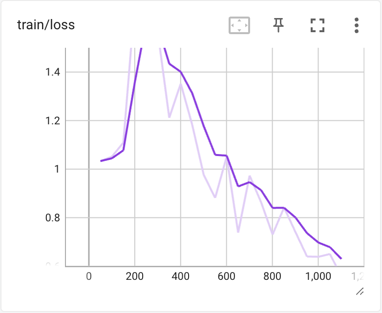 | 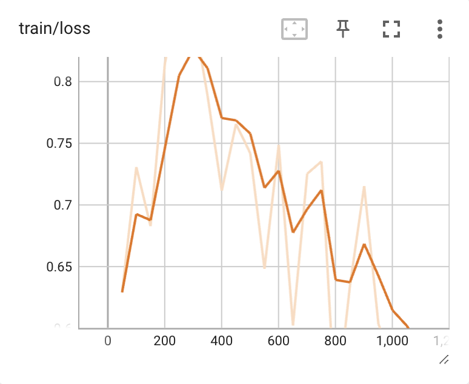 |

### Intersection Over Union (IoU)

|            |       giou |       diou | ciou       |
|:---------: | :--------: | :---------:| :---------:|
|            | Version 18 | Version 19 | Version 20 |
| eval_loss  | 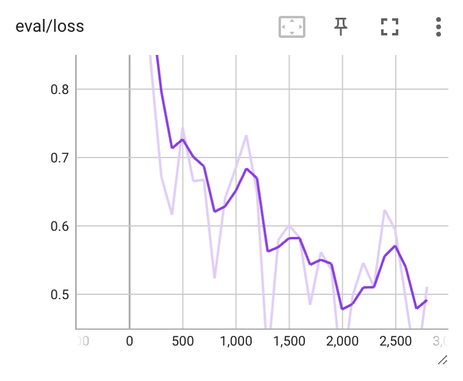 | 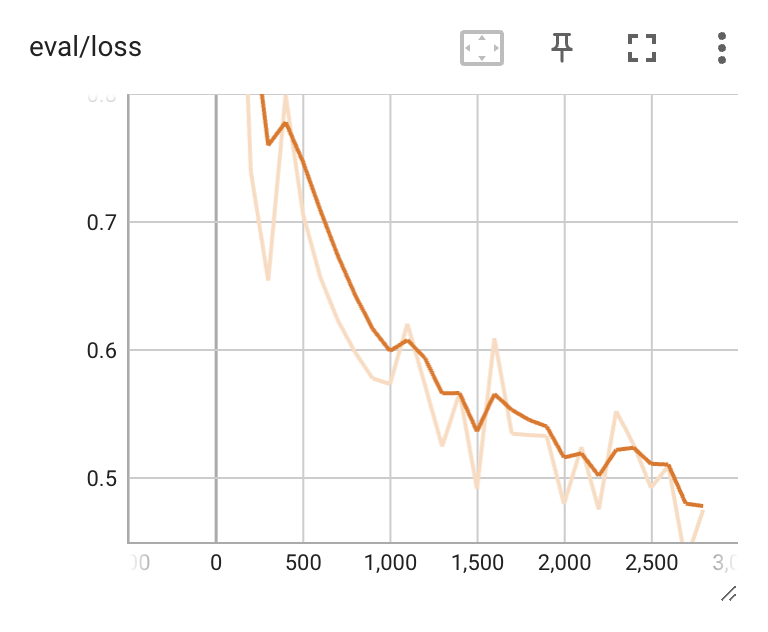 | 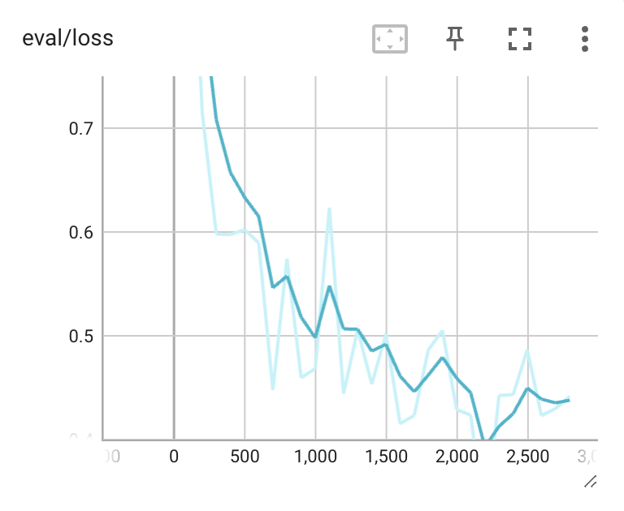 |
| train_loss | 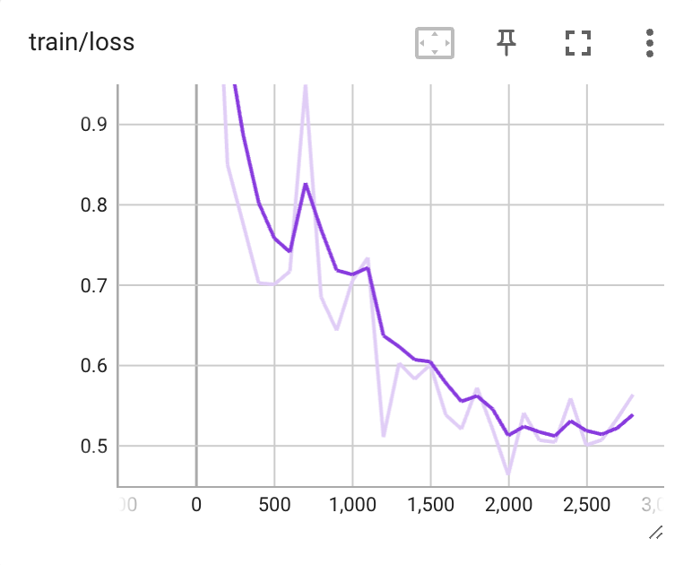 | 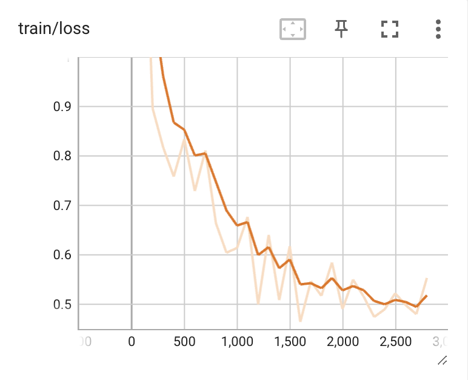 | 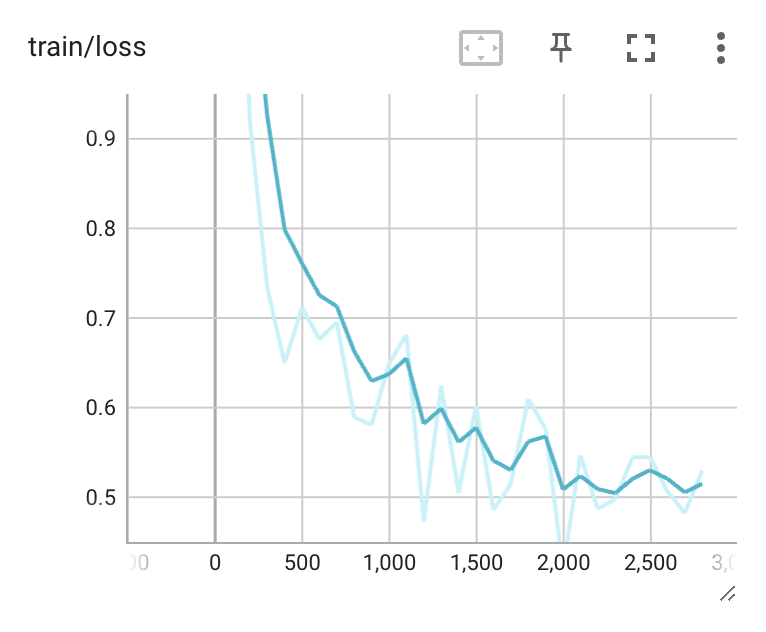 |

### Best Model Version 20_3

  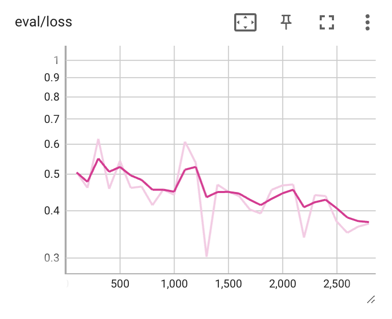
  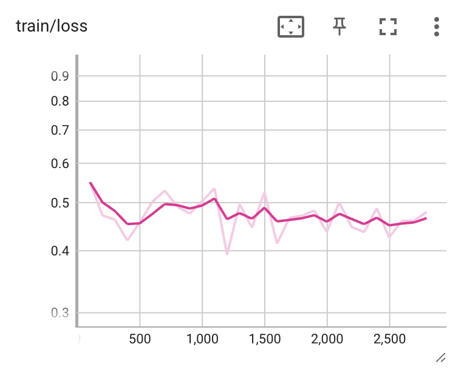
  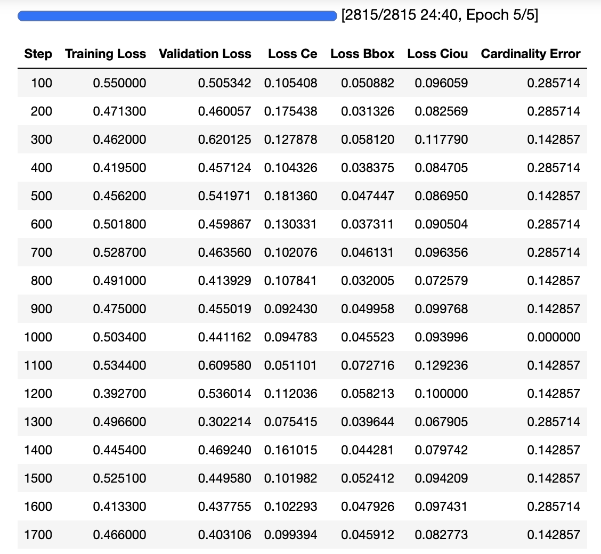
  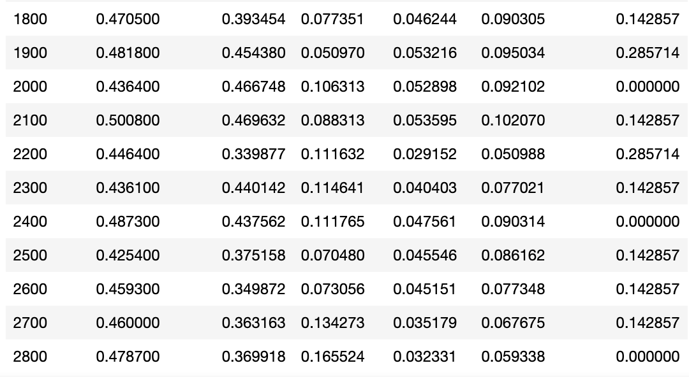

